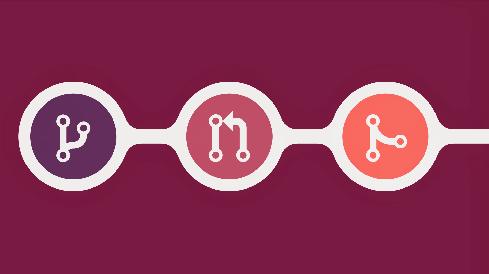

# Welcome to C0D1NG ✨

<div align="center">


**A beginner-friendly open source community that helps everyone start their open source journey! 🚀**

[View Contributors](https://github.com/C0D1NG/C0D1NG/blob/master/Contributors.md) • [Join Community](https://t.me/C0D1NG) • [Website](https://c0d1ng.github.io/)

</div>

---

## 🎯 About C0D1NG

C0D1NG is a welcoming open source organization designed specifically for beginners who want to make their first contribution to the open source world. We believe that everyone should have the opportunity to contribute to open source projects, regardless of their experience level.

### 🌟 What we offer:

- **Beginner-friendly environment** for your first open source contribution
- **Step-by-step guidance** through the contribution process
- **Supportive community** to help you along the way
- **Recognition** for all contributors in our Contributors list

## � Project Stats

- **Total Contributors:** 200+ developers from around the world
- **First Contributions:** Perfect for your first PR
- **Community Support:** Active Telegram group for help and discussion

---

## 🔄 Understanding the GitHub Flow



### 1. **CREATE A BRANCH** 🌿

Create a branch in your project where you can safely experiment and make changes.

- Isolate your work from the main codebase
- Add commits to track your progress

### 2. **OPEN A PULL REQUEST** 🔄

Use a pull request to get feedback on your changes from developers worldwide.

- Collaborate and discuss your improvements
- Get code reviews from the community

### 3. **MERGE AND DEPLOY** ✅

Merge your changes into the main branch and celebrate your contribution!

- Your code becomes part of the project
- You're now an open source contributor!

---

## 🚀 Quick Start Guide

Ready to make your first contribution? Follow these simple steps:

### Prerequisites

- Git installed on your computer
- A GitHub account
- Basic knowledge of Git commands (don't worry, we'll guide you!)

### Step-by-Step Instructions

#### 1. **Fork this repository** 🍴

Click the "Fork" button at the top right of this page to create your own copy.

#### 2. **Clone to your local machine** 💻

```bash
git clone https://github.com/YOUR_USERNAME/C0D1NG.git
cd C0D1NG
```

#### 3. **Create a new branch** 🌿

```bash
git checkout -b add-your-name
```

#### 4. **Add your name to Contributors.md** ✏️

- Open `Contributors.md`
- Find the appropriate alphabetical section
- Add your entry: `- [Your Name](https://github.com/your-username)`

#### 5. **Commit your changes** 💾

```bash
git add Contributors.md
git commit -m "Add [Your Name] to contributors"
```

#### 6. **Push to GitHub** ⬆️

```bash
git push origin add-your-name
```

#### 7. **Create a Pull Request** 🎯

- Go to your forked repository on GitHub
- Click "Compare & pull request"
- Add a meaningful title and description
- Submit your pull request!

### 🎉 Congratulations!

You've just made your first open source contribution! Welcome to the community! 🚀

---

## 📝 Contribution Guidelines

To maintain the quality and organization of our project, please follow these guidelines:

### ✅ Do's

- Add your name in the correct alphabetical section
- Use the format: `- [Your Name](https://github.com/your-username)`
- Keep your changes focused on adding your name only
- Write clear commit messages

### ❌ Don'ts

- Don't modify other contributors' entries
- Don't add multiple names in one PR
- Don't make unnecessary changes to the README or other files

## 🤝 Community

### Join our vibrant community:

- **Telegram:** [C0D1NG Community](https://t.me/C0D1NG)
- **Website:** [c0d1ng.github.io](https://c0d1ng.github.io/)

### Getting Help

- Check existing issues before creating new ones
- Join our Telegram for real-time support
- Tag maintainers in your PR if you need assistance

## 📈 Next Steps

After making your first contribution here, you might want to:

1. **Explore more projects** on [GitHub](https://github.com/topics/good-first-issue)
2. **Learn more about Git** with [Git tutorials](https://learngitbranching.js.org/)
3. **Join more communities** like [Dev.to](https://dev.to/), [Hashnode](https://hashnode.com/)
4. **Start your own open source project**

## 🏆 Hall of Fame

Check out our amazing [Contributors list](https://github.com/C0D1NG/C0D1NG/blob/master/Contributors.md) featuring 200+ developers from around the globe! 🌍

## 📄 License

This project is open source and available under the [MIT License](LICENSE).

---

<div align="center">

**Made with ❤️ by the C0D1NG community**

⭐ Star this repository if it helped you make your first contribution!

</div>
